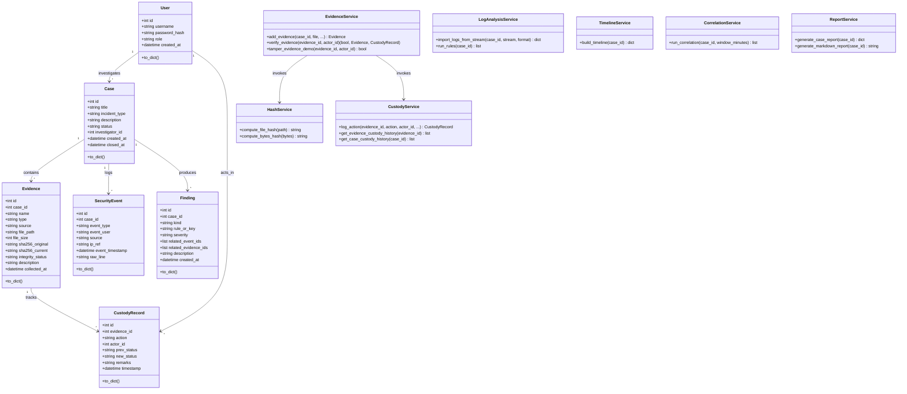

# TraceX — UML Class Diagram

```mermaid
classDiagram
    class User {
        +int id
        +string username
        +string password_hash
        +string role
        +datetime created_at
        +to_dict()
    }

    class Case {
        +int id
        +string title
        +string incident_type
        +string description
        +string status
        +int investigator_id
        +datetime created_at
        +datetime closed_at
        +to_dict()
    }

    class Evidence {
        +int id
        +int case_id
        +string name
        +string type
        +string source
        +string file_path
        +int file_size
        +string sha256_original
        +string sha256_current
        +string integrity_status
        +string description
        +datetime collected_at
        +to_dict()
    }

    class CustodyRecord {
        +int id
        +int evidence_id
        +string action
        +int actor_id
        +string prev_status
        +string new_status
        +string remarks
        +datetime timestamp
        +to_dict()
    }

    class SecurityEvent {
        +int id
        +int case_id
        +string event_type
        +string event_user
        +string source
        +string ip_ref
        +datetime event_timestamp
        +string raw_line
        +to_dict()
    }

    class Finding {
        +int id
        +int case_id
        +string kind
        +string rule_or_key
        +string severity
        +list related_event_ids
        +list related_evidence_ids
        +string description
        +datetime created_at
        +to_dict()
    }

    class HashService {
        +compute_file_hash(path) string
        +compute_bytes_hash(bytes) string
    }

    class CustodyService {
        +log_action(evidence_id, action, actor_id, ...) CustodyRecord
        +get_evidence_custody_history(evidence_id) list
        +get_case_custody_history(case_id) list
    }

    class EvidenceService {
        +add_evidence(case_id, file, ...) Evidence
        +verify_evidence(evidence_id, actor_id) (bool, Evidence, CustodyRecord)
        +tamper_evidence_demo(evidence_id, actor_id) bool
    }

    class LogAnalysisService {
        +import_logs_from_stream(case_id, stream, format) dict
        +run_rules(case_id) list
    }

    class TimelineService {
        +build_timeline(case_id) dict
    }

    class CorrelationService {
        +run_correlation(case_id, window_minutes) list
    }

    class ReportService {
        +generate_case_report(case_id) dict
        +generate_markdown_report(case_id) string
    }

    User "1" --> "*" Case : investigates
    User "1" --> "*" CustodyRecord : acts_in
    Case "1" --> "*" Evidence : contains
    Case "1" --> "*" SecurityEvent : logs
    Case "1" --> "*" Finding : produces
    Evidence "1" --> "*" CustodyRecord : tracks
    EvidenceService --> HashService : invokes
    EvidenceService --> CustodyService : invokes
```
