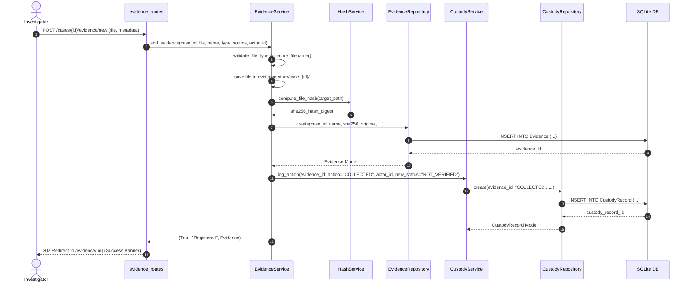
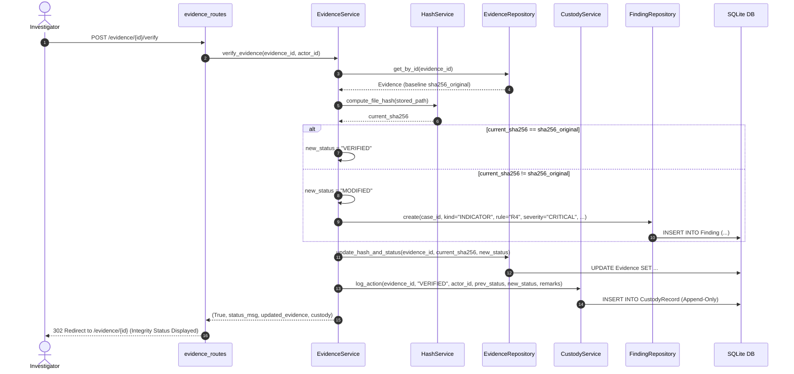
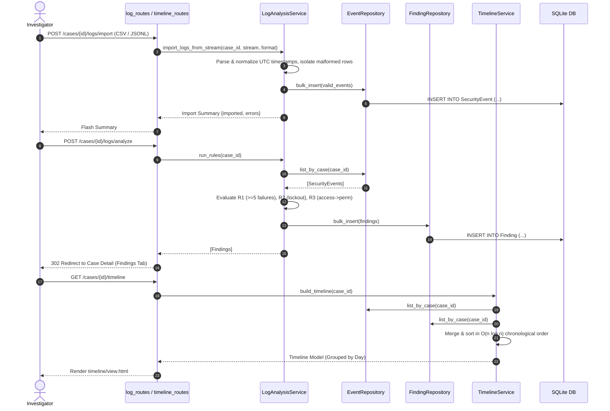

# TraceX — UML Sequence Diagrams

## 1. Digital Evidence Acquisition & SHA-256 Hashing Sequence

---

## 2. Integrity Verification & Tamper Detection Sequence

---

## 3. Log Ingestion, Rule Engine & Timeline Sequence

