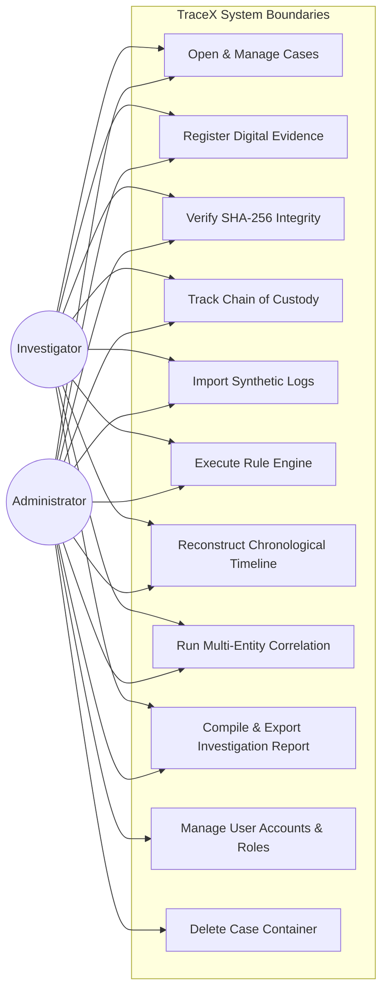

# TraceX — UML Use Case Diagram

```mermaid
graph LR
    Investigator((Investigator))
    Admin((Administrator))

    subgraph TraceX System Boundaries
        UC1[Open & Manage Cases]
        UC2[Register Digital Evidence]
        UC3[Verify SHA-256 Integrity]
        UC4[Track Chain of Custody]
        UC5[Import Synthetic Logs]
        UC6[Execute Rule Engine]
        UC7[Reconstruct Chronological Timeline]
        UC8[Run Multi-Entity Correlation]
        UC9[Compile & Export Investigation Report]
        UC10[Manage User Accounts & Roles]
        UC11[Delete Case Container]
    end

    Investigator --> UC1
    Investigator --> UC2
    Investigator --> UC3
    Investigator --> UC4
    Investigator --> UC5
    Investigator --> UC6
    Investigator --> UC7
    Investigator --> UC8
    Investigator --> UC9

    Admin --> UC1
    Admin --> UC2
    Admin --> UC3
    Admin --> UC4
    Admin --> UC5
    Admin --> UC6
    Admin --> UC7
    Admin --> UC8
    Admin --> UC9
    Admin --> UC10
    Admin --> UC11
```
