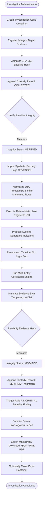

# TraceX — Forensic Investigation Workflow Diagram

```mermaid
flowchart TD
    Start([Investigator Authentication]) --> OpenCase[Create Investigation Case Container]
    OpenCase --> AcquireEvidence[Register & Ingest Digital Evidence]
    AcquireEvidence --> CalcHash[Compute SHA-256 Baseline Hash]
    CalcHash --> AppendCustody1[Append Custody Record: 'COLLECTED']
    AppendCustody1 --> Verify1{Verify Baseline Integrity}
    Verify1 -->|Matches| VerifiedState[Integrity Status: VERIFIED]
    
    VerifiedState --> IngestLogs[Import Synthetic Security Logs CSV/JSONL]
    IngestLogs --> ParseFilter[Normalize UTC Timestamps & Filter Malformed Rows]
    ParseFilter --> RunRules[Execute Deterministic Rule Engine R1-R3]
    RunRules --> GenFindings[Produce System-Generated Indicators]
    
    GenFindings --> BuildTimeline[Reconstruct Timeline: O n log n Sort]
    BuildTimeline --> RunCorrelation[Run Multi-Entity Correlation Engine]
    
    RunCorrelation --> DemoTamper[Simulate Evidence Byte Tampering on Disk]
    DemoTamper --> ReVerify{Re-Verify Evidence Hash}
    ReVerify -->|Mismatch| ModState[Integrity Status: MODIFIED]
    ModState --> AppendCustody2[Append Custody Record: 'VERIFIED' - Mismatch]
    AppendCustody2 --> TriggerR4[Trigger Rule R4: CRITICAL Severity Finding]
    
    TriggerR4 --> GenReport[Compile Formal Investigation Report]
    GenReport --> ExportOptions[Export Markdown / Download JSON / Print PDF]
    ExportOptions --> CloseCase[Optionally Close Case Container]
    CloseCase --> End([Investigation Concluded])
```
